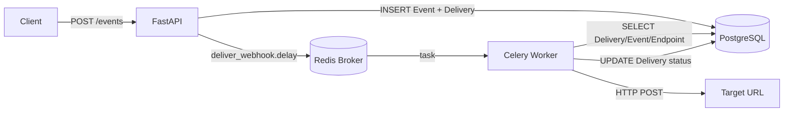

# Webhook Delivery Service

A focused backend learning project demonstrating asynchronous webhook delivery using FastAPI, Celery, PostgreSQL, and Redis.

---

## What It Does

Registers webhook endpoints, creates domain events, and asynchronously delivers those events to registered URLs — with automatic retry on failure and full delivery status tracking.

---

## Five Core Features

| # | Feature | Description |
|---|---------|-------------|
| 1 | **Register Webhook** | `POST /webhooks` stores an endpoint (event_type + target_url) |
| 2 | **Create Event** | `POST /events` persists an event and queues async deliveries |
| 3 | **Async Delivery** | Celery worker sends the HTTP POST to the target URL |
| 4 | **Retry on Failure** | Up to 3 total attempts (1 initial + 2 retries) |
| 5 | **Track Status** | `GET /deliveries` and `GET /deliveries/{id}` show PENDING / SUCCESS / FAILED |

---

## Tech Stack

| Layer | Technology |
|-------|-----------|
| API | Python 3.12, FastAPI, Uvicorn |
| Task Queue | Celery 5 |
| Message Broker | Redis 7 |
| Database | PostgreSQL 16, SQLAlchemy 2.0 |
| Validation | Pydantic v2 |
| HTTP Client | HTTPX |
| Infrastructure | Docker Compose |

---

## Architecture



---

## Request Flow

```
Client
  │
  ├─ POST /webhooks  →  store WebhookEndpoint in PostgreSQL
  │
  ├─ POST /events
  │     │
  │     ├─ store Event in PostgreSQL
  │     ├─ create PENDING Delivery for each matching endpoint
  │     ├─ call deliver_webhook.delay(delivery_id)  →  Redis queue
  │     └─ return 201 immediately (no HTTP wait)
  │
  └─ Celery Worker (async)
        ├─ load Delivery, Event, Endpoint from PostgreSQL
        ├─ increment attempts
        ├─ HTTP POST payload to target_url
        ├─ SUCCESS → update status to SUCCESS
        └─ FAILURE → retry (up to 3 total) → FAILED on exhaustion
```

---

## Retry Behaviour

```
Attempt 1  →  fail  →  retry scheduled (delay: 10s)
Attempt 2  →  fail  →  retry scheduled (delay: 10s)
Attempt 3  →  fail  →  status = FAILED, last_error stored
                        No further attempts.
```

- `max_retries=2` in Celery means 1 initial + 2 retries = **3 total**.
- Every actual HTTP attempt increments `attempts` by exactly 1.
- Success at any attempt → `status = SUCCESS`, task ends immediately.

---

## How to Run

```bash
# 1. Clone / enter the project directory
cd "Webhook"

# 2. Start all four services
docker compose up --build
```

The API will be available at **http://localhost:8000**  
Interactive docs: **http://localhost:8000/docs**

---

## How to Test the Webhook Flow

### Step 1 – Start a public test receiver
Use [https://webhook.site](https://webhook.site) to get a free temporary URL.  
Copy the unique URL shown (e.g. `https://webhook.site/your-uuid`).

### Step 2 – Register a webhook endpoint
```bash
curl -X POST http://localhost:8000/webhooks \
  -H "Content-Type: application/json" \
  -d '{"event_type": "order.created", "target_url": "https://webhook.site/your-uuid"}'
```

### Step 3 – Create an event
```bash
curl -X POST http://localhost:8000/events \
  -H "Content-Type: application/json" \
  -d '{"event_type": "order.created", "payload": {"order_id": 101, "amount": 2500}}'
```

### Step 4 – Check delivery status
```bash
# All deliveries
curl http://localhost:8000/deliveries

# Single delivery
curl http://localhost:8000/deliveries/1
```

### Step 5 – Test retry (use a bad URL)
Register a webhook with `"target_url": "http://localhost:9999/bad"` (unreachable).  
Create an event. Watch the Celery worker logs — it will attempt delivery 3 times and  
then set `status = FAILED`.

---

## Example API Requests

**Register webhook:**
```json
POST /webhooks
{
  "event_type": "order.created",
  "target_url": "https://webhook.site/your-uuid"
}
```

**Create event:**
```json
POST /events
{
  "event_type": "order.created",
  "payload": {"order_id": 101, "amount": 2500}
}
```

**Delivery response:**
```json
{
  "id": 1,
  "event_id": 1,
  "endpoint_id": 1,
  "status": "SUCCESS",
  "attempts": 1,
  "last_error": null,
  "created_at": "2024-01-01T10:00:00Z",
  "updated_at": "2024-01-01T10:00:02Z"
}
```
